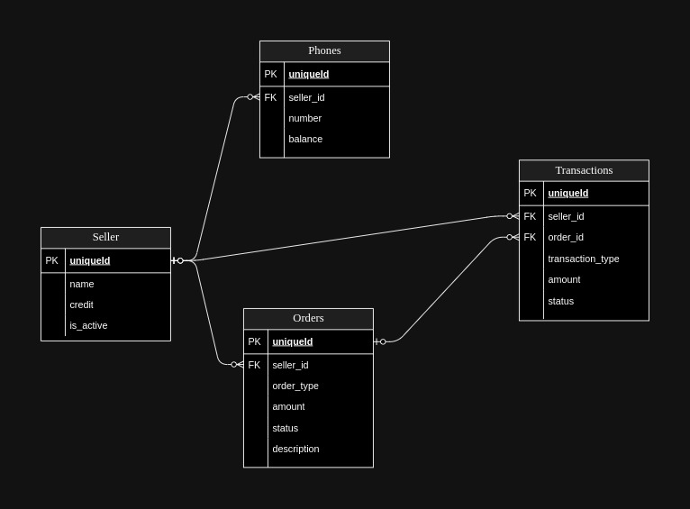
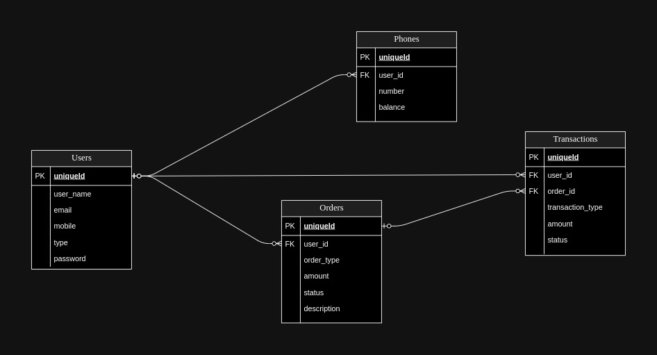

# مستندات فنی مدل
در ورژن اول این پروژه قسمت های لاگین و هندل کردن دسترسی ها به دلیل کمبود وقت انجام نشده است و در ورژن دوم این موضوع در نظر گرفته خواهد شد

# دیاگرام ورژن 1


# دیاگرام ورژن 2



## ویژگی‌ها
- فروشندگان می‌توانند درخواست افزایش اعتبار ثبت کنند که توسط اپراتور باید تایید ‌شود.
- فروشندگان می‌توانند از اعتبار خود برای شارژ شماره‌های تلفن استفاده کنند.
- سیستم تضمین می‌کند که اعتبار هیچ فروشنده‌ای منفی نمی‌شود.
- تمام تراکنش‌ها به صورت دقیق برای حسابداری ثبت می‌شود.

## نیازمندی‌ها

- Python 3.8+
- Django 4.x
- PostgreSQL
- Docker (برای کانتینرسازی)
- Nginx (برای سرویس‌دهی اپلیکیشن)

## راه‌اندازی و نصب

برای راه‌اندازی پروژه به صورت محلی یا در یک محیط کانتینری، مراحل زیر را دنبال کنید.

### 1. کلون کردن ریپازیتوری

```bash
git clone https://github.com/username/b2b-recharge-system.git
cd b2b-recharge-system
```

## نصب نیازمندی ها

```bash
python3 -m venv venv
source venv/bin/activate  # در ویندوز: venv\Scripts\activate
pip install -r requirements.txt
```

## راه‌اندازی پایگاه داده

```bash
python manage.py migrate

python manage.py runserver

```

# اجرای اپلیکیشن در Docker

برای اجرای اپلیکیشن در کانتینرهای Docker از Docker Compose استفاده کنید.

##  ساخت و شروع کانتینرها
اطمینان حاصل کنید که Docker و Docker Compose نصب شده باشند. سپس، دستور زیر را اجرا کنید:

```bash
docker-compose up --build
```